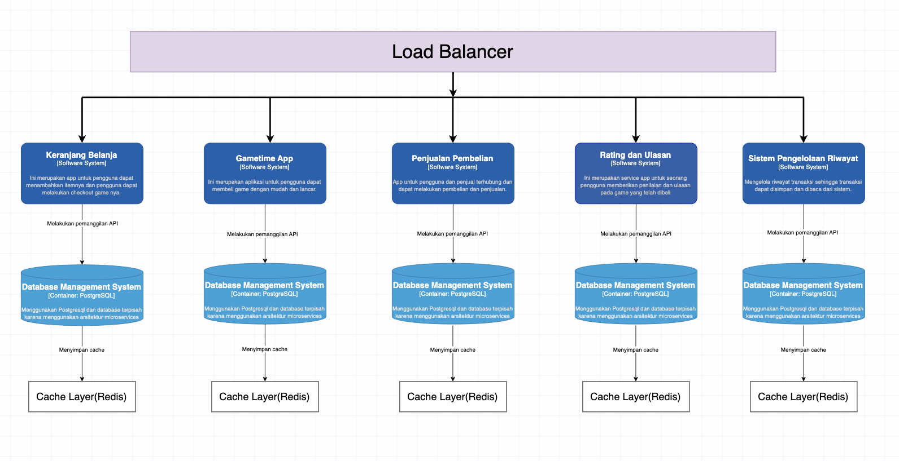

# Game Time Diagram

## Context Diagram

## Container Diagram

## Deployment Diagram

## Risk Storming

Setelah melakukan risk storming, disepakati bahwa arsitektur baru akan menggunakan load balancer untuk mengelola distribusi lalu lintas ke layanan mikro untuk meningkatkan kinerja. Layanan mikro seperti Keranjang Belanja, Gametime App, Penjualan Pembelian, Rating dan Ulasan, serta Sistem Pengelolaan Riwayat, masing-masing akan memiliki fungsionalitas spesifik dan dapat diskalakan secara independen. Setiap layanan mikro akan menggunakan PostgreSQL untuk menjaga konsistensi data dan mendukung skalabilitas. Redis akan digunakan sebagai cache layer untuk meningkatkan kinerja dengan menyimpan data yang sering diakses. Implementasi CI/CD pipelines dan alat pemantauan seperti Prometheus dan Grafana akan digunakan untuk memastikan sistem dapat di-deploy dan dimonitor secara efisien.

## Keranjang

### Keranjang Component Diagram

Berikut adalah diagram untuk komponen pada fitur keranjang

### Keranjang Code diagram
Untuk code diagram keranjang adalah sebagai berikut 

## Penjualan Pembelian

### Pejualan Pembelian Component Diagram
Berikut adalah diagram untuk komponen pada fitur Penjualan Pembelian

### Penjualan Pembelian Code diagram

